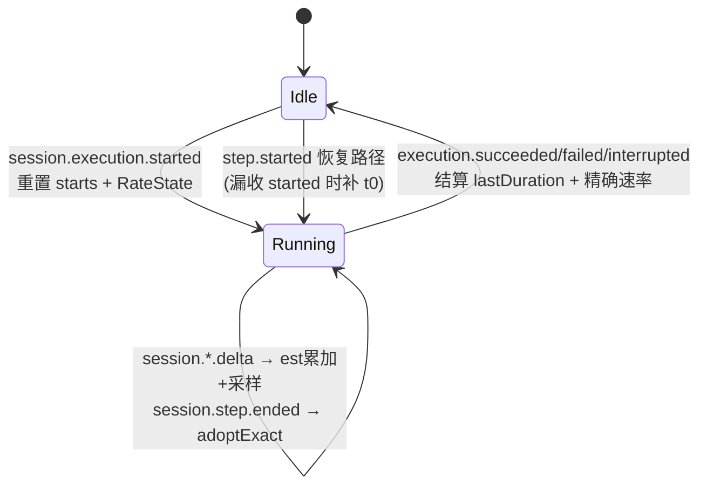
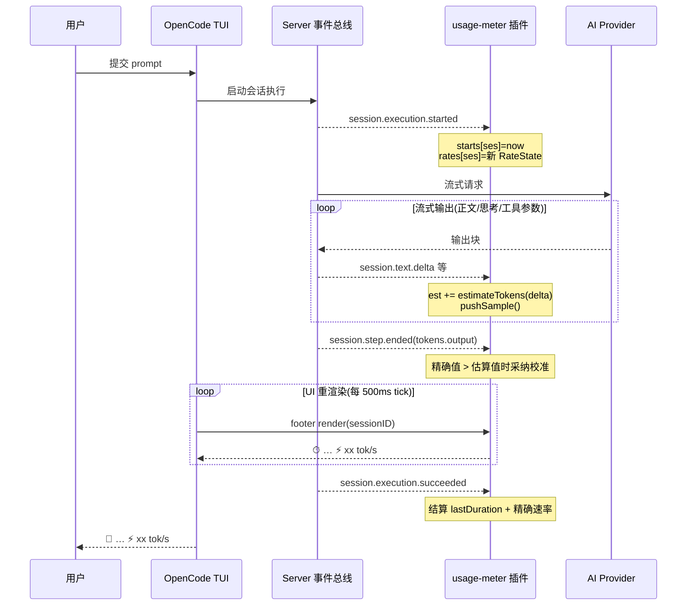

# 事件模型与状态机

## 事件订阅清单

| 事件 | 时机 | 载荷(经 `dataOf` 解包后) | 用途 |
|---|---|---|---|
| `session.execution.started` | 轮次开始 | `{sessionID}` | `starts.set(now)`;重置 `RateState` |
| `session.step.started` | 步骤开始 | `{sessionID, started, ...}` | 恢复路径:漏收 started 时用 `started` 补 |
| `session.execution.succeeded` / `failed` / `interrupted` | 轮次结束 | `{sessionID}` | 结算:时长 + 精确速率,清理状态 |
| `session.text.delta` | 正文流式块 | `{sessionID, assistantMessageID, ordinal, delta}` | **实时速率主数据源** |
| `session.reasoning.delta` | 思考流式块 | 同上 | 计入输出 |
| `session.tool.input.delta` | 工具参数 JSON 流式块 | 同上 | 计入输出 |
| `session.step.ended` / `failed` | 步骤结束 | `{sessionID, assistantMessageID, tokens, cost}` | **精确 token 校准** |
| `message.part.delta` / `message.updated` | (旧事件族) | — | 兜底,带防双计锁 |

## 信封解包(`dataOf`)

TUI 数据总线把载荷放在 `event.data`;官方 SDK 原始信封放在 `event.properties`。兼容三者:

```ts
const dataOf = (event) => event?.data ?? event?.properties ?? event
```

## 双事件族设计

当前 OpenCode V2 运行时以 **`session.*` 族**广播流式输出;本地安装的 SDK 类型文件可能过期(只含旧 `message.part.*` 词汇),不能作为依据。设计上**双族共存**:

- `session.*` 族:主路径,优先;
- `message.*` 族:兜底(兼容其他 OpenCode 版本);
- **防双计锁** `RateState.sessionVocab`:本轮一旦收到任一 `session.*` delta,后续 `message.part.delta` 全部忽略——同一内容块绝不计两次。

## 状态数据结构

```ts
type MsgRate = {
  est: number           // 本消息累计估算 token(来自 delta 流)
  exact?: number        // 最近一次采纳的精确 output token
  refEst: number        // 采纳 exact 时的 est 快照(用于偏差重整)
}
type RateState = {
  msgs: Map<messageID, MsgRate>
  samples: Array<{ t: number; tok: number }>   // (时刻, 累计 token) 采样
  sessionVocab: boolean                         // 防双计锁
}
```

**消息总 token**:`msgTotal = exact + max(0, est − refEst)`(未采纳精确值时即 `est`)
**轮次总 token**:`turnTotal = Σ msgTotal`(支持一轮多消息/多步)

## 轮次状态机



状态全部为**进程内存态**:重启 OpenCode 后上轮统计清零,新一轮自然重建。(校准系数与设置除外——经 storage 持久化。)

## 冷启动回填(0.7.5)

内存态清零带来一个体验缺口:重开终端后接手的旧会话,在完成下一轮之前 footer/右栏不显示 `🏁/⚡`。0.7.5 起补上——footer 与右栏渲染时,对本实例内**没有**轮次记录的会话惰性触发 `backfillLastTurn`:

- 数据源:已同步的权威消息记录(`session.message.list`,与 finishTurn 精确结算同源),零新增采集/请求
- 回放口径(0.7.12 对齐实时结算):该轮窗口内**首条 assistant 消息 `created` → 末条已完成 assistant `completed`** 即上轮时长(消除"用户发消息→轮次开跑"的排队等待;与精确速率的 created→completed 同基);assistant 消息 `Σ(output+reasoning) ÷ Σ(created→completed)` 即精确速率(同 0.6.5 口径)
- 三重防护:已有实时记录不覆盖(实时值优先)、`starts` 存在(运行中)不写、末条 user 消息之后无已完成回复(会话在别处运行中)不显示旧值
- 触发即忘:每次挂载先查守卫(Map/Set 查询)。重试并非每 tick——footer/右栏槽位渲染均经函数子节点包裹(0.7.10/0.7.12),组件体随宿主槽位调用/重挂载执行;0.7.12 起**结构性无望**(列表非空但无 user 锚点)的会话记入负缓存不再重扫,瞬态(列表未同步/上轮在别处运行中)保持重扫直至轮次完成——0.7.5 接手场景不受影响,残余限制见 [known-issues.md](../decisions/known-issues.md)


## 交互时序图



交互式版本见 [interaction-sequence.html](../interaction-sequence.html)(可缩放/高亮/导出)。
