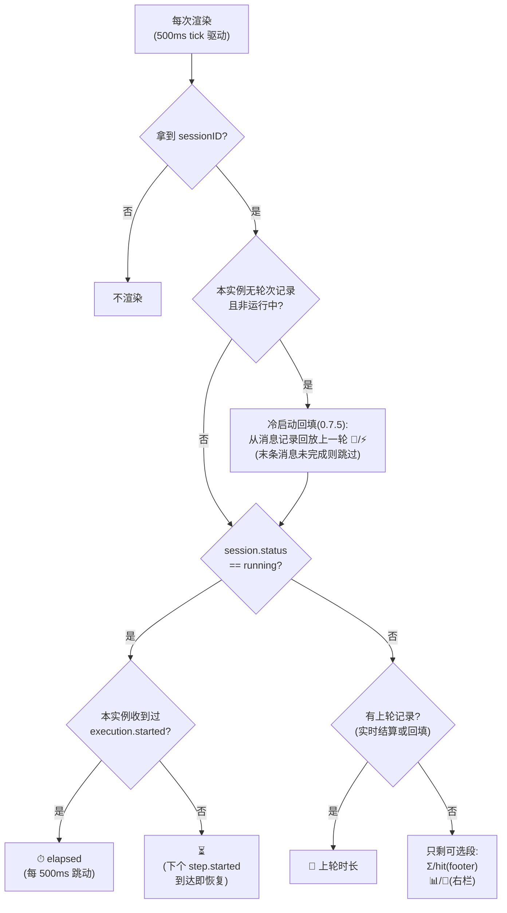
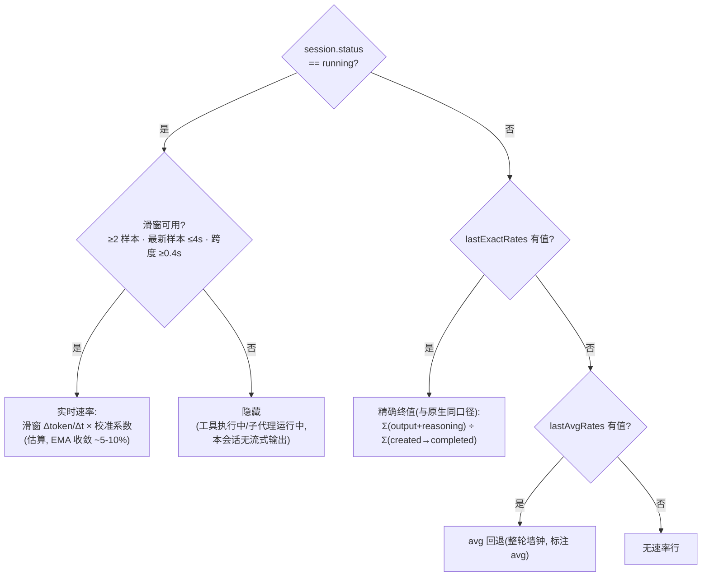

# 显示逻辑与功能总览

一页看懂:插件有哪些表面与指标、每个指标何时显示/隐藏、数据从哪来、为什么有时"不见了"。判定条件均以代码为准(`footer-status.tsx` / `sidebar-metrics.tsx` / `session-metrics.ts` / `stats-source.ts`)。

## 功能清单

### UI 表面(四处)

| 表面 | 内容 | 默认 | 开关 |
|---|---|---|---|
| footer 状态行(`prompt.footer.status`) | `⏱`/`⏳`/`🏁` + `⚡`;可选 `Σ`、`hit`/`hit·s` | ⏱/⚡ 常开,Σ/hit 关 | `/usage-settings` 内 `f`/`h` |
| 右栏 Stats 块(`sidebar.content`) | 可收起头部(0.7.9,点击 `▼/▸` 切换)+ 计时/速率行 + `📊 (范围)` + `🎯 (范围)` | 开 | `/usage-settings` 内 `b`(整块);头部点击收起 |
| 统计面板(`session.panel`) | 当前会话 + 当前窗口 + 本会话累计 + 子代理 + 明细表 | 命令唤起 | `/usage-full` |
| 设置弹窗 | 五项配置,响应式刷新 | 命令唤起 | `/usage-settings` |

### 命令与按键

| 入口 | 动作 |
|---|---|
| `/usage-full`(或命令面板"用量统计") | 开/收起统计面板;面板聚焦时 `f` 全屏,`Esc` 收起 |
| `/usage-settings`(或命令面板"用量设置") | 打开设置弹窗 |
| 弹窗内 `d` | hit 维度:今日汇总 ⇄ 当前会话(严格口径) |
| 弹窗内 `s` | **Σ/📊 总耗维度(0.7.7)**:今日 → 近24小时 → 近7日 → 近30日 循环 |
| 弹窗内 `f` / `h` / `b` | footer Σ 段 / footer hit 段 / 右栏块 |
| 命令面板"切换 hit 维度" | 免弹窗直切 + toast(兜底个别宿主弹窗 keybind 注册失败) |

全部选择经 `storage.store("usage-meter.settings")` 持久化,跨重启、跨 TUI 实例同步;旧存储缺键按文档默认归一。

### 顺手的开发工具

| 工具 | 用途 |
|---|---|
| `npm test` | 57 例断言用例(node:test 汇总计数 58,`test-loader.mjs` 解析钩子文件本身计 1 条),零依赖(Node ≥22 原生 type stripping) |
| `pwsh scripts/verify-install.ps1` | 一键安装自验证(发布闭环固定最后一步,见 [AGENTS.md](../../AGENTS.md)) |

## 计时/速率显示判定(footer 与右栏同款逻辑)

> 渲染驱动(0.7.12 起三环链路定版,四处表面一致):所有动态读取(`now()`、会话状态、stats 信号、设置信号)都在 `createMemo` 内完成 → JSX 插值/槽位渲染经**函数子节点**包裹、落入被跟踪的 render effect → 500ms tick 每次显式 `renderer.requestRender()` 上屏(宿主按需绘制,树更新本身不刷屏)。signal 一变即重绘,不依赖宿主重挂。演进史:0.7.7 及以前文本在组件体内预计算(footer 靠宿主高频重绘掩盖、右栏空闲冻结);0.7.8 挪入 memo 但漏跟踪环;0.7.10 补函数子节点;0.7.11 补 requestRender;0.7.12 把面板与 footer slot 一并补齐(此前面板仍急切求值)。

## ⚡ 速率来源判定

## Σ/📊 总耗维度(0.7.7)

`Σ`(footer 可选段)、`📊`(右栏)、面板头部 `Σ` 共用同一个**总耗维度**设置,经 `/usage-settings` 按 `s` 循环:

| 维度 | 统计口径 | footer 显示 | 右栏显示 |
|---|---|---|---|
| 今日(默认) | 本地零点 → 现在 | `Σ 1.6M`(不带标签) | `📊 1.6M / 500M (today)` |
| 近24小时 | 滚动窗口 now−24h | `Σ 1.6M (24h)` | `📊 1.6M / 500M (24h)` |
| 近7日 | 滚动窗口 now−7d | `Σ 12M (7d)` | `📊 12M / 300M (7d)` |
| 近30日 | 滚动窗口 now−30d | `Σ 51M (30d)` | `📊 51M / 900M (30d)` |

- 只有**激活维度**会触发额外查询(一条只读 stats 请求);hit 维度(`d`)独立于此,始终基于今日数据
- 刷新时机:加载时、每步结束 1.5s 防抖、60s 周期、跨零点——`fetchTotals()` 统一带动今日 + 激活滚动窗
- 维度标签在非"今日"时强制显示,防止滚动窗口数字被误读为"今日"

## "为什么没显示"速查表

| 现象 | 原因 | 何时恢复 |
|---|---|---|
| `⏳` 无时间无速率 | 会话运行中,但**本 TUI 实例**没收到它的 `execution.started`——典型:重启/新开终端后接手正在运行的会话(轮次起点在旧实例里);或子代理长期运行,父会话无自身事件 | 该会话下一个自身 `step.started`/流式 delta 到达,即恢复 `⏱`/`⚡` |
| 运行中只有 `⏱`,`⚡` 消失 | 本会话 >4s 无流式输出(工具执行间隙、子代理干活、思考无输出) | 恢复流式输出即回 |
| 跑完一轮,`⏱` 变 `🏁` | 设计:空闲显示上轮终值,计时让位 | 下一轮开始即回 `⏱` |
| 打开旧会话,计时/速率行全无 | 本实例无该会话轮次记录;若上一条消息还没跑完(在别处运行中),回填按防护跳过 | 空闲会话由回填立即补 `🏁/⚡`;运行中会话等轮次结束 |
| `📊/🎯` 有,`⏱/⚡` 无 | stats 是**服务端聚合**(跨实例存活);计时/速率是**本实例内存态**(事件驱动) | 本实例内该会话完成一轮 |
| 切了 Σ 维度后数字没变 | 滚动窗口数据需要一次查询,首刷前显示旧维度数据 | 0.7.12 起弹窗 `s` 切换即触发拉取,≤500ms tick 内上屏;另有每步结束 1.5s 防抖与 60s 周期兜底 |
| footer 什么都不显示 | 全新会话未发过消息(无记录),且 Σ/hit 默认关 | 发一条消息即现 |

## 数据来源矩阵

| 指标 | 数据源 | 跨 TUI 实例 |
|---|---|---|
| `⏱`/`⚡` 运行中 | 本实例事件流(`session.*.delta`/`step.*`)+ 滑窗估算 | 否 |
| `🏁`/`⚡` 空闲 | 轮结束权威结算(`session.message.list` 聚合);冷启动回填同源 | 回填后可见(读已同步消息) |
| `Σ`/`📊`(今日或滚动窗)、`hit`(today) | 服务端原生聚合 API(`client.session.stats`,`from/to` 按维度取窗,覆盖全部会话含 headless/子代理) | **是**(服务端持久) |
| `🎯` / `hit·s` | 今日 stats 聚合 或 `session.get(sessionID).tokens`(会话严格口径) | 是 |
| 当前窗口/本会话累计/子代理 | 已同步 TUI 状态(`session.get`/`message.list`/`parentID` 委派树)+ 一次性 `session.sync` | **是**(服务端权威) |
| 校准系数 | `storage.store("usage-meter.calib")` 按模型持久化 | 是 |
| 用户设置(含 Σ 维度) | `storage.store("usage-meter.settings")` | 是 |

## 两类状态的存活边界(必读)

- **服务端态**(📊/🎯/Σ/hit/窗口/累计/子代理):数据在服务端,重启终端、换终端、接手会话都在
- **实例内存态**(⏱ 运行计时/⚡ 实时滑窗):随 TUI 进程存活;重启清零后由两条路径恢复——① 该会话发生新轮次;② 空闲会话由 0.7.5 冷启动回填从消息记录回放上一轮 `🏁/⚡`。**唯一不可恢复**:接手"正在运行中"的会话,其起点时间戳无法回放(防护性跳过),显示 `⏳` 直到该会话自身下一个事件到达

相关细节:[footer 状态行](footer.md) · [右栏 Stats 块](sidebar-stats.md) · [设置弹窗](settings.md) · [计量与速率算法](../architecture/token-accounting.md) · [事件模型与状态机](../architecture/events-and-state.md) · [用量统计与口径](../architecture/usage-statistics.md)
